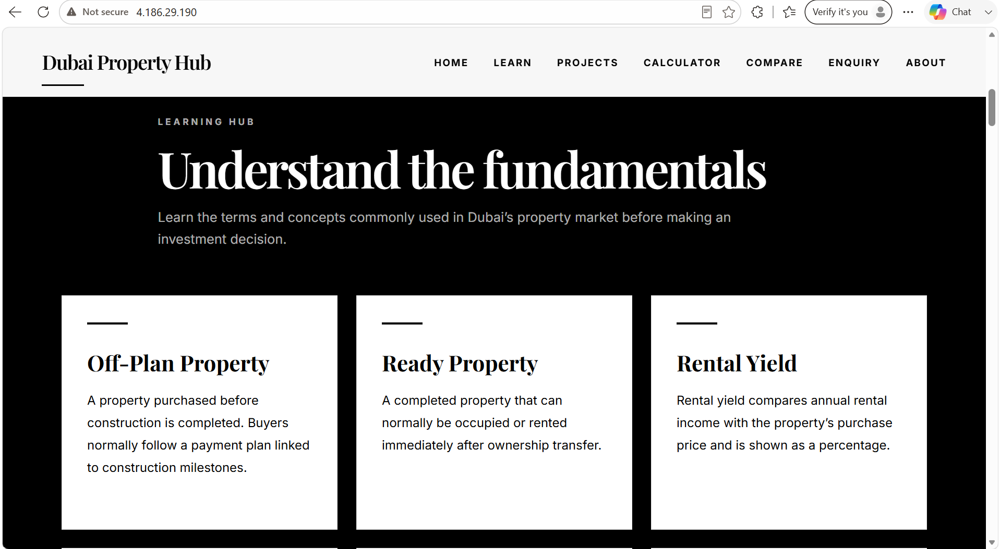
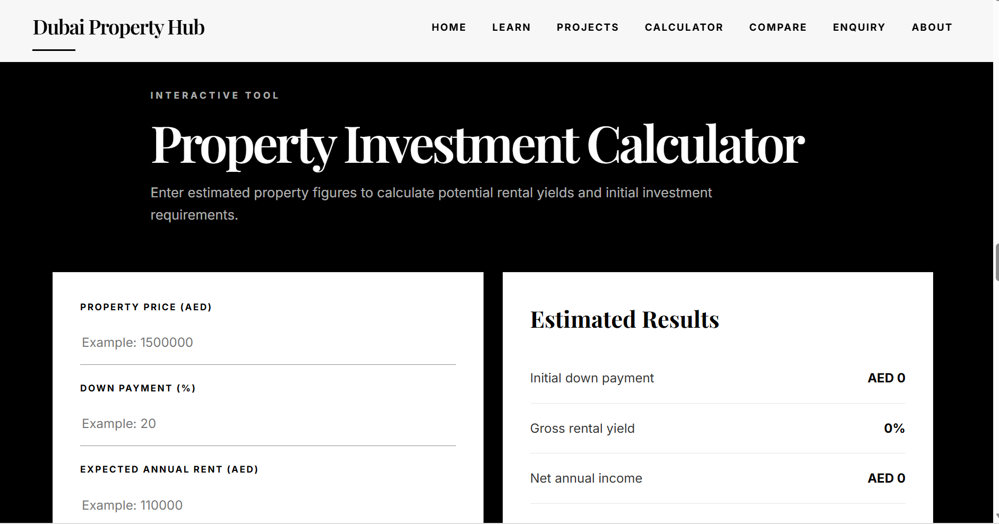
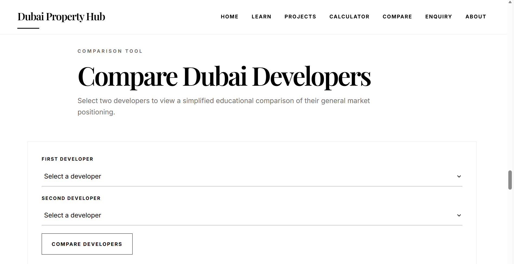
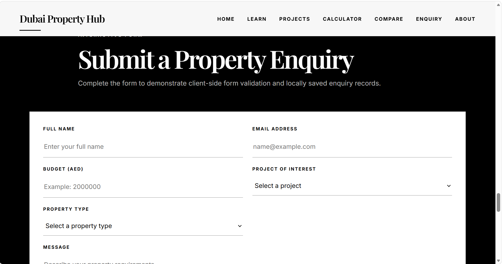
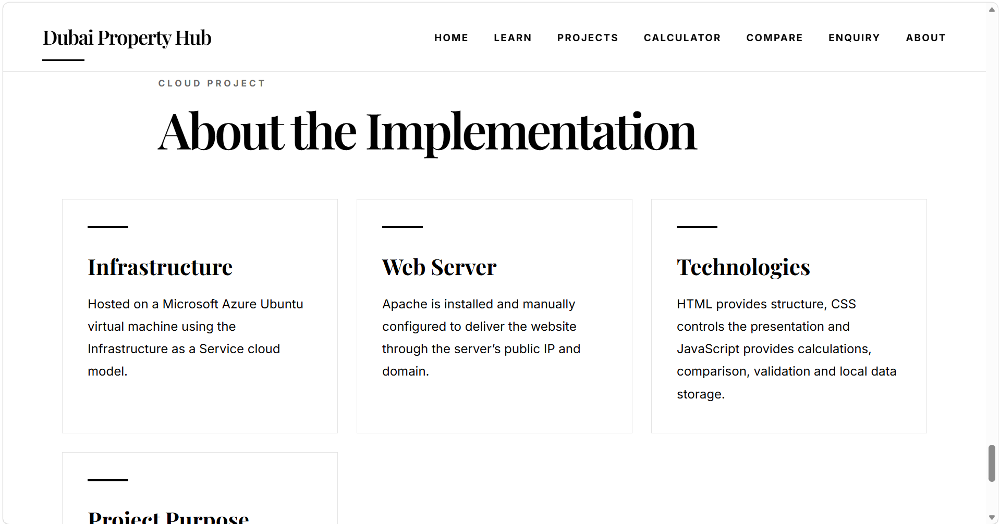

# Dubai Property Hub

Dubai Property Hub is a cloud-hosted educational website developed for the ICT171 Cloud Server Project at Murdoch University Dubai.

The purpose of this project is to demonstrate the deployment of a modern web application using Microsoft Azure Infrastructure as a Service (IaaS), Ubuntu Linux, Apache Web Server, GitHub version control, DNS configuration, SSL/TLS encryption and client-side scripting.

The website introduces users to the fundamentals of Dubai real estate investing through educational content, interactive calculators, developer comparisons and a property enquiry system.

---

# Live Website

## Custom Domain

https://www.dubaipropertyhub.org

Alternative:

https://dubaipropertyhub.org

## Public IP

http://4.186.29.190

---

# Features

- Responsive multi-page website
- Dubai Real Estate Learning Hub
- Featured Dubai property developments
- Property Investment Calculator
- Developer Comparison Tool
- Property Enquiry Form
- Client-side JavaScript validation
- Local Storage enquiry history
- Interactive navigation
- MIT Licensed project

---

# Technologies Used

## Frontend

- HTML5
- CSS3
- JavaScript (ES6)

## Cloud Infrastructure

- Microsoft Azure Virtual Machine (Ubuntu Linux)
- Apache2 Web Server
- SSH
- Namecheap DNS
- Let's Encrypt SSL/TLS
- Certbot

## Version Control

- Git
- GitHub

---

# Website Sections

- Home
- Learning Hub
- Featured Projects
- Investment Calculator
- Developer Comparison
- Property Enquiry
- About

---

# Project Structure

```text
ICT171-Cloud-Server-Project
│
├── css/
│   └── style.css
│
├── images/
│
├── js/
│   └── script.js
│
├── screenshots/
│
├── Documentation/
│
├── index.html
│
└── README.md
```

---

# Documentation

Project documentation is provided in the **Documentation** folder.

Included documentation:

- Architecture.md
- Azure-Deployment.md
- DNS-and-SSL.md
- Bash-Script.md
- GitHub.md
- Technologies.md

The documentation explains how the cloud server was deployed, configured and secured, allowing another ICT171 student to recreate the project without relying on external resources.

---

# Azure Deployment

The website is deployed on a Microsoft Azure Ubuntu Virtual Machine running Apache2.

Deployment process:

1. Create Ubuntu Virtual Machine
2. Configure Azure Network Security Group
3. Install Apache2
4. Configure the custom domain using Namecheap DNS
5. Install SSL/TLS using Certbot and Let's Encrypt
6. Upload website files using SSH
7. Verify HTTPS functionality
8. Test automatic SSL certificate renewal

---

# Project Highlights

This project demonstrates:

- Microsoft Azure Infrastructure as a Service (IaaS)
- Ubuntu Linux server administration
- Apache2 Web Server configuration
- DNS configuration using Namecheap
- SSL/TLS implementation using Certbot
- Git and GitHub version control
- Responsive web design
- Client-side JavaScript
- Local Storage implementation
- Interactive user experience

---

# Screenshots

## Home Page


## Learning Hub



## Featured Projects


## Investment Calculator



## Developer Comparison



## Property Enquiry



## About



---

# Technical Evidence

The repository also contains technical evidence demonstrating the successful deployment and configuration of the cloud server, including:

- Azure Virtual Machine Overview
- Azure Networking Configuration
- Namecheap DNS Records
- SSL Certificate
- SSL Renewal Test
- Apache Server Status
- Bash Script Output
- GitHub Repository
- Documentation Folder

---

# Author

**Khadija Noor**

Murdoch University Dubai

**ICT171 – Cloud Server Project**

**Student ID:** 35279053

---

# License

This project is licensed under the **MIT License**.

For more information, visit:

https://opensource.org/licenses/MIT 